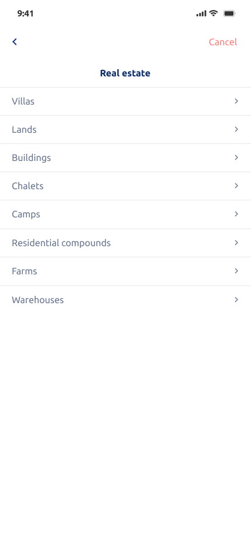

<h2> Hi there, I'm Mostafa Bastawy 👋:heart:   </h2>  

<!-- 
 -->
 

Good Morning all,

I am an experienced Flutter developer . I know mobile app guidelines and release that UX/UI quality is essential in mobile apps. That's why I am very attentive to design layout and consistently deliver pixel-perfect layouts tested on various devices.

I call myself a problem solver because I love challenges when it comes to programming. My objective is to help individuals and business enterprises to implement end-to-end business application solutions that increase production and operational efficiency.

Brief summary:
- 2+ years of mobile development experience
- believe in writing clean code
- always ready to learn new concepts and modern tech stack of development
- keen interest to follow best architecture and practices to build an easily scalable product
- excellent communication skills

Programming languages:
Dart, 

Front-end:
Flutter

Mobile
Flutter SDK

Tools:
 Upwork, Git, Github

If you are looking for a reliable resource and mobile expert then you are at right place. Let's hop on initial call and convert your idea into beautiful application.

<h2> Technical Skills </h2>
 
<!-- 
 -->
 
- Object Oriented Programming ( OOP )
- Problem Solving
- Flutter
- Dart
- Firebase Database
- Firebase Authentication
- REST APIS ( Dio & HTTP Packages )
- Shared Preference Database
- SQLlite
- Localization
- State Management ( Bloc )
- State Management ( Provider )
- Online Payment (payment gateways & in app purchases)
- Agora SDK (Streaming)

- 🔭 I’m currently working on improving my skills as a mobile application developer. 

 
<h2> Contact with me on </h2>

<!-- <h3>Where to find me</h3>

 -->

- email : mostafa.bastawyy@gmail.com
- phone : +201063136366

   

<!--   -->

<h2> Samples from my projects </h2>

### Yazl User App

YAZL – is a one-stop shop to find, book and review places of your interest, from beauty salons to restaurants, from dress rentals to kid’s entertainment. Enjoy additional discounts, offers and be a part of special events.

 

### Yazl Partner App

YAZL is a solution for businesses that want to focus on both quality and growth.
Partner app and additional Web Management Panel let you manage your visibility on the platform, inform your existing customers on changes, novelties and incentives and advertise yourself, thus additionally get new customers.

 

### Cureseven App

Cureseven is a medical Application which gives the user the ability to reserve cosmetic surgeries and contact a lot of doctors with many different medical packages, also the user can contact directly with chosen doctor through the app using (direct messages & voice calling & video calling), this app will be deployed with many languages and will work in Turkey as a first stage.

 

### WEBY App

WEBY Application gives the user the ability to sell products like alasoom but with more different option as in WEBY the user pays fixed $ per minute for using livestream and has the ability to keep it after finished to be recorded for flexible number of days, also has the ability to make his normal ads as vip ads to be more showable and get more customers also users has the ability to chat with support if they have any issue, this app is coming in 3 languages (English & Russian & Azerbaijani) and will work in Azerbaijani as a first stage.

 

### Alasoom App

Alasoom Application gives the user ability to list and sell his staff using two ways first traditional listing the product with full details, second by using live-streaming to present his staff and describe its feature and price and replying to onetime messaging. this app is monitoring by 3 levels of authorities (supervisors & Adding & General manager) each of them has his own authorities, this app contain two languages (Arabic & English) and working in Saudi Arabia as and planned to be used in all Gulf countries.

 

<h2> Applications Screenshots and Tutorial </h2>

<!-- 
 -->

## Cureseven App Video

## Cureseven App Screenshots

<table>
  <tr>
    <td></td>
    <td></td>
    <td></td>
  </tr>
 </table>

<table>
  <tr>
    <td></td>
    <td></td>
    <td></td>
  </tr>
 </table>

<table>
  <tr>
    <td></td>
    <td></td>
    <td></td>
  </tr>
 </table>

<table>
  <tr>
    <td></td>
    <td></td>
    <td></td>
  </tr>
 </table>

<table>
  <tr>
    <td></td>
    <td></td>
    <td></td>
  </tr>
 </table>

<table>
  <tr>
    <td></td>
    <td></td>
    <td></td>
  </tr>
 </table>

<table>
  <tr>
    <td></td>
    <td></td>
    <td></td>
  </tr>
 </table>

<table>
  <tr>
    <td></td>
    <td></td>
    <td></td>
  </tr>
 </table>

<table>
  <tr>
    <td></td>
    <td></td>
    <td></td>
  </tr>
 </table>

<table>
  <tr>
    <td></td>
  </tr>
 </table>

## WEBY App Video

## WEBY App Screenshots

<table>
  <tr>
    <td></td>
    <td></td>
    <td></td>
  </tr>
 </table>

<table>
  <tr>
    <td></td>
    <td></td>
    <td></td>
  </tr>
 </table>

<table>
  <tr>
    <td></td>
    <td></td>
    <td></td>
  </tr>
 </table>

<table>
  <tr>
    <td></td>
    <td></td>
    <td></td>
  </tr>
 </table>

<table>
  <tr>
    <td></td>
    <td></td>
    <td></td>
  </tr>
 </table>

<table>
  <tr>
    <td></td>
    <td></td>
    <td></td>
  </tr>
 </table>

<table>
  <tr>
    <td></td>
    <td></td>
    <td></td>
  </tr>
 </table>

<table>
  <tr>
    <td></td>
    <td></td>
    <td></td>
  </tr>
 </table>

<table>
  <tr>
    <td></td>
  </tr>
 </table>

## Alasoom App Video

https://user-images.githubusercontent.com/81096412/151624869-e3d79c9a-8ff3-4bd7-a3ea-6eec596c6e6e.mp4

## Alasoom App Screenshots

<table>
  <tr>
    <td></td>
    <td></td>
    <td></td>
  </tr>
 </table>

<table>
  <tr>
    <td></td>
    <td></td>
    <td></td>
  </tr>
 </table>

<table>
  <tr>
    <td></td>
    <td></td>
    <td></td>
  </tr>
 </table>

<table>
  <tr>
    <td></td>
    <td></td>
    <td></td>
  </tr>
 </table>

<table>
  <tr>
    <td></td>
    <td></td>
    <td></td>
  </tr>
 </table>

<table>
  <tr>
    <td></td>
    <td></td>
    <td></td>
  </tr>
 </table>

<table>
  <tr>
    <td></td>
    <td></td>
    <td></td>
  </tr>
 </table>

<table>
  <tr>
    <td></td>
    <td></td>
    <td></td>
  </tr>
 </table>

<table>
  <tr>
    <td></td>
    <td></td>
    <td></td>
  </tr>
 </table>

<table>
  <tr>
    <td></td>
  </tr>
 </table>

    

